# 腾讯会议软件问题排查

会议中用户遇到的，大部分都是第三方软件或环境问题。

相关文档

[电脑音箱有滋滋声怎么办？](https://jingyan.baidu.com/article/fea4511ad68e84b6ba91254a.html)

[扬声器设备播放采样率](https://jingyan.baidu.com/article/a3f121e4cdcf40bd9052bb99.html)

[windows 驱动安装](./windows%20驱动检查和安装.md)

## 音频问题

#### 音频扬声器无声

硬件问题排查

1. 尝试使用其他软件，检查是否无声？

如果无声，则大概率设备损坏或未选中正确播放设备。

2. 尝试使用微信电话，检查是否无声？

如果无声，则大概率是设备驱动有问题，或设备损坏。

3. 尝试外接一可用耳机，观察是否正常。

如果无声，则大概率设备驱动问题。

##### windows 笔记本

1. 检查是否是 小米，联系，华硕，华为 笔记本，是否系统自带以下软件

   检查小米电脑管家，会议降噪功能，选择关闭。

   检查联想电脑管家，AI 功能，降噪功能，选择关闭

   检查华硕电脑管家 AI 降噪麦克风，选择关闭
   [华硕电脑管家设置](https://www.asus.com.cn/support/faq/1045651/)
   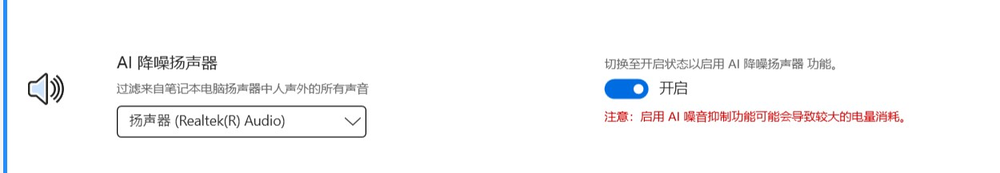

   华为电脑管家，AI 降噪软件，选择关闭
   [华为电脑管家设置](https://consumer.huawei.com/cn/support/content/zh-cn15894562/)
   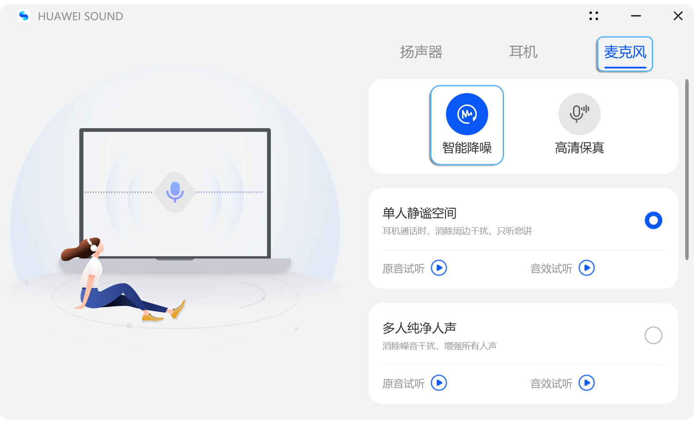

##### windows

1. 尝试打开 windows 麦克风声音，或音量合成器观察是否被静音。部分品牌会自动静音某些软件。
   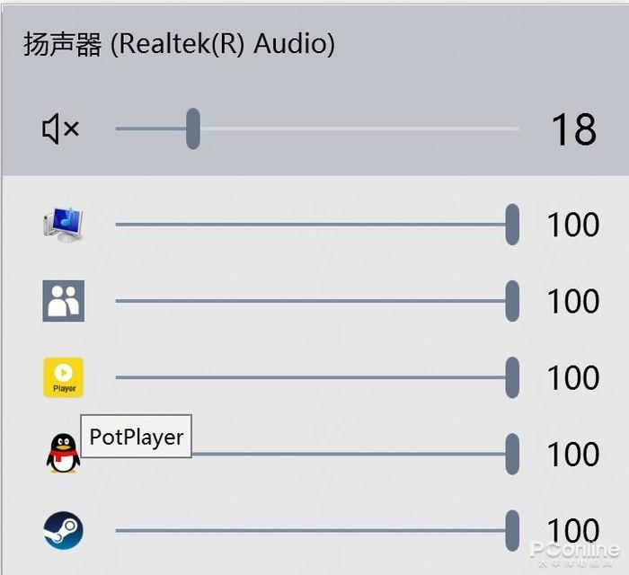

2. 尝试检查系统服务

   重启音频相关服务 ​​∙ 按 ​​Win + R​​ 输入 services.msc → 找到以下服务并重启：

   ​​Windows Audio​​（设为“自动”启动）；

   ​​Windows Audio Endpoint Builder​​。

3. 如果声音质量较低，禁用音频增强 ​​

   声音设置 → ​​ 设备属性 → 增强 ​​ → 勾选 ​​“禁用所有增强功能”​​。

   部分声卡驱动自带降噪/回声消除功能，可尝试启用（如 Realtek 控制面板）。

4. 蓝牙耳机出现问题，无法连接或使用，打开 AVCTP 服务

   第一步："开始"栏里，搜索"服务"，点击打开

   第二步：在服务列表里面，找到 AVCTP 服务，双击打开详情面板，点击启动

5. 检查系统隐私权限设置。

   检查电脑是否安装了，火绒，腾讯电脑管家等，检查是否有麦克风，扬声器权限拦截。

   进入 ​​ 设置 > 隐私 > 麦克风 ​​，确保：​“允许应用访问麦克风”​​ 已开启；目标应用（如会议软件、录音工具）的麦克风权限已启用；

6. 禁用 “独占模式”​​

   检查应用冲突，以及独占模式。关闭所有其他软件。

   右键任务栏声音图标 → ​​ 声音设置 → 更多声音设置 → 录制 ​​ → 双击当前麦克风 → ​​ 高级 ​​ → 取消勾选 ​​“允许应用独占控制此设备”​

7. 更新声卡/麦克风驱动，可参考制造商官网或设备厂家官网；

8. 检查设备连接，确保麦克风连接正常，尝试更换 USB 端口或使用其他麦克风测试；排除插线磨损原因。

9. 设备异常查看

   打开设备管理器。同时按下 Windows 徽标键和 R 键。这应该会打开 运行框

   输入 devmgmt.msc

   按下 enter

   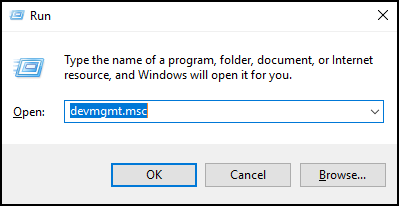

   打开设备管理，找到声音下拉，检查是否有感叹号 ⚠️ 设备，重装过驱动再查看是否还是 ⚠️，如果依旧是感叹号，这表明设备损坏概率较大。

   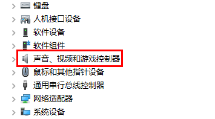

##### Android

1. 重装软件

   重装可以排除大部分软件自身问题

2. 检查系统，软件权限设置，将电话，麦克风，蓝牙相关权限打开

   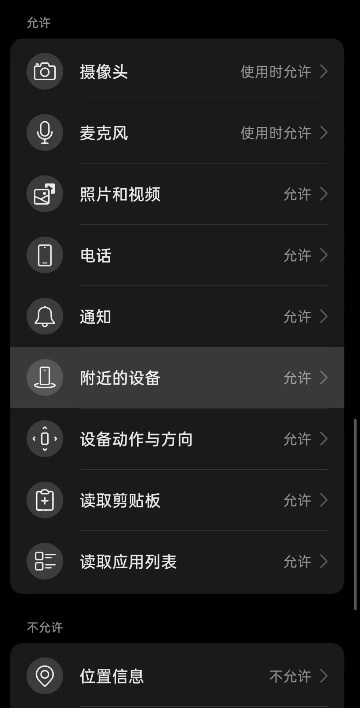

##### IOS

1. 重装软件

   重装可以排除大部分软件自身问题

##### MAC

1. 权限问题，检查系统权限设置

   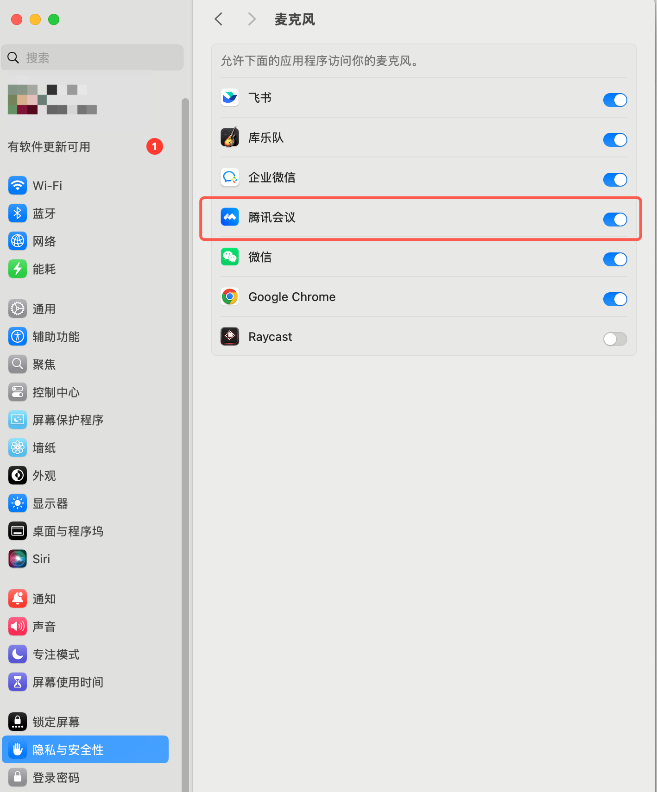

2. 扬声器选择

   如插入了耳机或蓝牙音频设备，检查是否选择了该设备

3. 检查驱动

   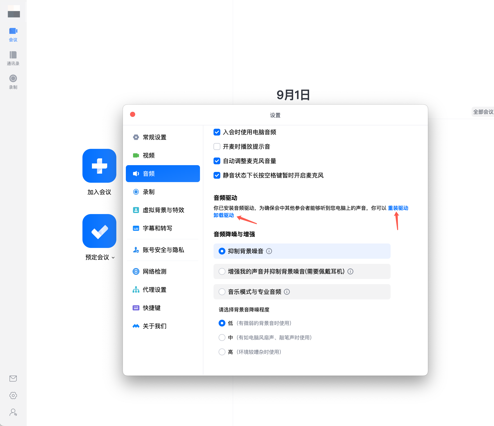

#### 声音质量较差

1. 检查网络

   使用测速工具检测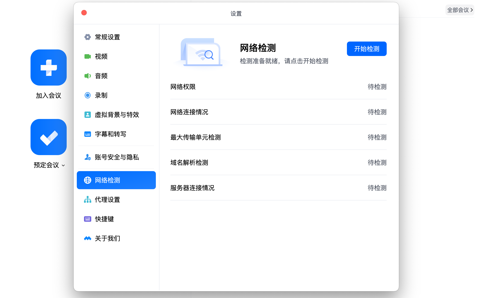

##### windows

1.  检查驱动

#### 声音延迟

1. 检查网络。

   使用测速工具检测

#### 人工入口

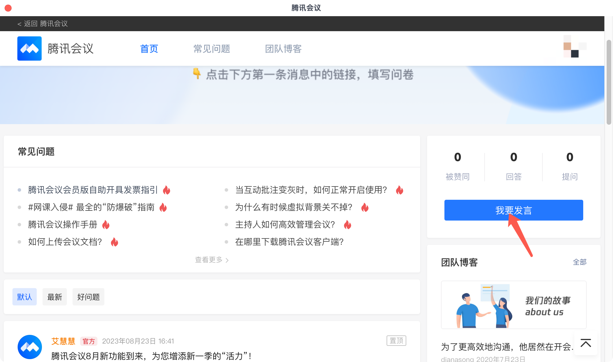

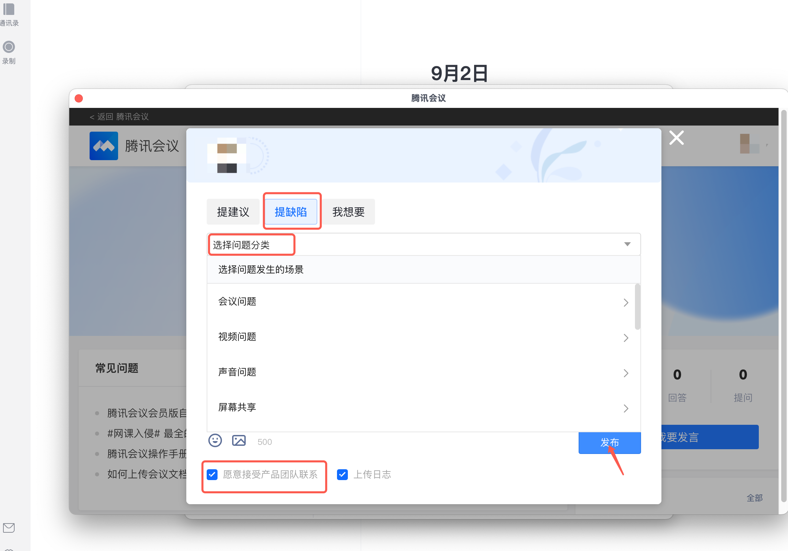
