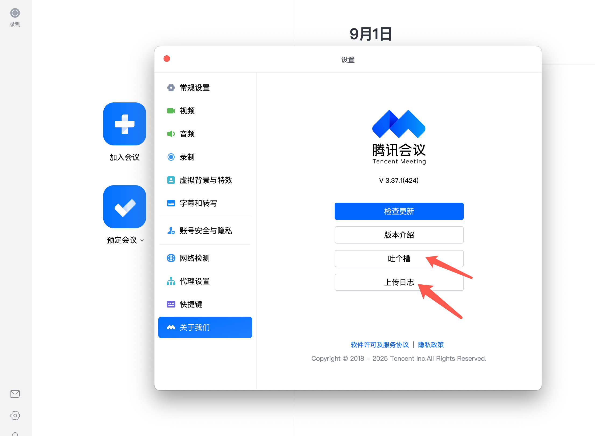

# 腾讯会议软件问题排查

会议中用户遇到的，大部分都是第三方软件或环境问题。

相关文档

[电脑音箱有滋滋声怎么办？](https://jingyan.baidu.com/article/fea4511ad68e84b6ba91254a.html)

[扬声器设备播放采样率](https://jingyan.baidu.com/article/a3f121e4cdcf40bd9052bb99.html)

[windows 驱动安装](./windows%20驱动检查和安装.md)

## 音频问题

#### 音频扬声器无声

硬件问题排查

1. 尝试使用其他软件，检查是否无声？

如果无声，则大概率设备损坏或未选中正确播放设备。

2. 尝试使用微信电话，检查是否无声？

如果无声，则大概率是设备驱动有问题，或设备损坏。

3. 尝试外接一可用耳机，观察是否正常。

如果无声，则大概率设备驱动问题。

##### windows 笔记本

1. 检查是否是 小米，联系，华硕，华为 笔记本，是否系统自带以下软件

   检查小米电脑管家，会议降噪功能，选择关闭。

   检查联想电脑管家，AI 功能，降噪功能，选择关闭

   检查华硕电脑管家 AI 降噪麦克风，选择关闭
   [华硕电脑管家设置](https://www.asus.com.cn/support/faq/1045651/)
   

   华为电脑管家，AI 降噪软件，选择关闭
   [华为电脑管家设置](https://consumer.huawei.com/cn/support/content/zh-cn15894562/)
   

##### windows

在开始检查前，请先根据
[微软官网，windows 中的声音或音频问题](https://support.microsoft.com/zh-cn/windows/%E4%BF%AE%E5%A4%8D-windows-%E4%B8%AD%E7%9A%84%E5%A3%B0%E9%9F%B3%E6%88%96%E9%9F%B3%E9%A2%91%E9%97%AE%E9%A2%98-73025246-b61c-40fb-671a-2535c7cd56c8#id0edd=windows_11)排除基本问题。

1. 尝试打开 windows 麦克风声音，或音量合成器观察是否被静音。部分品牌会自动静音某些软件。
   

2. 尝试检查系统服务

   重启音频相关服务 ​​∙ 按 ​​Win + R​​ 输入 services.msc → 找到以下服务并重启：

   ​​Windows Audio​​（设为“自动”启动）；

   ​​Windows Audio Endpoint Builder​​。

   找到 AVCTP 服务，双击打开详情面板，点击启动

3. 如果声音质量较低，禁用音频增强 ​​

   声音设置 → ​​ 设备属性 → 增强 ​​ → 勾选 ​​“禁用所有增强功能”​​。

   部分声卡驱动自带降噪/回声消除功能，可尝试启用（如 Realtek 控制面板）。

4. 蓝牙耳机出现问题，无法连接或使用，打开 AVCTP 服务

   第一步："开始"栏里，搜索"服务"，点击打开

   第二步：在服务列表里面，找到 AVCTP 服务，双击打开详情面板，点击启动

   4.1 蓝牙模式设置（低概率被禁用，但是可以检查下）

   蓝牙有几种不同的音频模式/“配置文件”。

   A2DP / 有时被称为它们的编解码器 AAC / AptX：仅使用所有可用的蓝牙带宽进行音频输出。

   HSP / HFP：在音频输出和输入之间分配可用的蓝牙带宽。

   为了让你的麦克风工作，你的电脑和耳机必须支持并启用 HSP / HFP / FastStream 等。

   由于你提到它以前是有效的，你的电脑或耳机可能由于某种原因无法协商 HSP/HFP。

   试试这个：控制面板 > 硬件和声音 > 设备和打印机。搜索你的耳机。右键单击它并选择“属性”。在“服务”选项卡下，确保“免提电话”和其他服务已启用。

5. 检查系统隐私权限设置。

   检查电脑是否安装了，火绒，腾讯电脑管家等，检查是否有麦克风，扬声器权限拦截。

   进入 ​​ 设置 > 隐私 > 麦克风 ​​，确保：​“允许应用访问麦克风”​​ 已开启；目标应用（如会议软件、录音工具）的麦克风权限已启用；

6. 禁用 “独占模式”​​

   检查应用冲突，以及独占模式。关闭所有其他软件。

   右键任务栏声音图标 → ​​ 声音设置 → 更多声音设置 → 录制 ​​ → 双击当前麦克风 → ​​ 高级 ​​ → 取消勾选 ​​“允许应用独占控制此设备”​

7. 更新声卡/麦克风驱动，可参考制造商官网或设备厂家官网；

8. 检查设备连接，确保麦克风连接正常，尝试更换 USB 端口或使用其他麦克风测试；排除插线磨损原因。

9. 设备异常查看

   打开设备管理器。同时按下 Windows 徽标键和 R 键。这应该会打开 运行框

   输入 devmgmt.msc

   按下 enter

   

   打开设备管理，找到声音下拉，检查是否有感叹号 ⚠️ 设备，重装过驱动再查看是否还是 ⚠️，如果依旧是感叹号，这表明设备损坏概率较大。

   

#### windows 共享时候，共享端音量过低，或单声道问题

[Microsoft 共享音量设置](https://support.microsoft.com/zh-cn/office/%E5%9C%A8microsoft-teams-%E4%BC%9A%E8%AE%AE%E6%88%96%E5%AE%9E%E6%97%B6%E4%BA%8B%E4%BB%B6%E4%B8%AD%E5%85%B1%E4%BA%AB%E8%AE%A1%E7%AE%97%E6%9C%BA%E7%9A%84%E5%A3%B0%E9%9F%B3-dddede9f-e3d0-4330-873a-fa061a0d8e3b#:~:text=%E9%9F%B3%E9%87%8F%E4%BD%8E%20%E5%A6%82%E6%9E%9C%E4%BD%BF%E7%94%A8%E7%9A%84%E6%98%AFWindows%EF%BC%8C%E5%88%99%E5%BD%93%E5%8A%A0%E5%85%A5%E5%9B%A2%E9%98%9F%E4%BC%9A%E8%AE%AE%E6%97%B6%EF%BC%8C%E8%AE%BE%E5%A4%87%E4%B8%AD%E5%85%B6%E4%BB%96%E5%A3%B0%E9%9F%B3%EF%BC%88%E5%A6%82%E9%80%9A%E7%9F%A5%E5%92%8C%E6%8F%90%E9%86%92%EF%BC%89%E7%9A%84%E9%9F%B3%E9%87%8F%E5%B0%86%E8%A2%AB%E9%99%8D%E4%BD%8E%E3%80%82%20%E5%A4%A7%E5%A4%9A%E6%95%B0%E6%83%85%E5%86%B5%E4%B8%8B%EF%BC%8C%E8%BF%99%E5%8F%AF%E8%83%BD%E6%98%AF%E4%BD%A0%E6%89%80%E5%B8%8C%E6%9C%9B%E7%9A%84%EF%BC%8C%E8%AE%A9%E4%BD%A0%E5%8F%AF%E4%BB%A5%E4%B8%93%E6%B3%A8%E4%BA%8E%E4%BC%9A%E8%AE%AE%E3%80%82%20%E4%BD%86%E6%98%AF%EF%BC%8C%E5%A6%82%E6%9E%9C%E8%A6%81%E5%85%B1%E4%BA%AB%E8%AE%A1%E7%AE%97%E6%9C%BA%E5%A3%B0%E9%9F%B3%EF%BC%8C%E7%94%A8%E4%BA%8E%E9%9D%99%E9%9F%B3%E5%85%B6%E4%BB%96%E7%B3%BB%E7%BB%9F%E5%A3%B0%E9%9F%B3%E7%9A%84%E7%9B%B8%E5%90%8C%E8%AE%BE%E7%BD%AE%E4%B9%9F%E4%BC%9A%E4%BD%BF%E4%BD%A0%E5%B0%9D%E8%AF%95%E5%85%B1%E4%BA%AB%E7%9A%84%E9%9F%B3%E9%A2%91%E9%9D%99%E9%9F%B3%E3%80%82%20%E8%8B%A5%E8%A6%81%E8%A7%A3%E5%86%B3%E6%AD%A4%E9%97%AE%E9%A2%98%EF%BC%8C%E8%AF%B7%E8%BD%AC%E5%88%B0%E7%B3%BB%E7%BB%9F%E7%9A%84%E5%A3%B0%E9%9F%B3%E8%AE%BE%E7%BD%AE%EF%BC%8C%E6%89%BE%E5%88%B0%E2%80%9C%E5%A3%B0%E9%9F%B3%E6%8E%A7%E5%88%B6%E9%9D%A2%E6%9D%BF%E2%80%9D%EF%BC%8C%E9%80%89%E6%8B%A9%E2%80%9C%E9%80%9A%E8%AE%AF%E2%80%9D%EF%BC%8C%E7%84%B6%E5%90%8E%E9%80%89%E6%8B%A9%E2%80%9C%E4%B8%8D%E6%89%A7%E8%A1%8C%E4%BB%BB%E4%BD%95%E6%93%8D%E4%BD%9C%E2%80%9D%E3%80%82%20%E6%9C%80%E5%90%8E%EF%BC%8C%E5%BA%94%E7%94%A8%E6%89%80%E5%81%9A%E7%9A%84%E6%9B%B4%E6%94%B9%EF%BC%8C%E4%BB%A5%E4%BE%BF%E5%85%B6%E4%BB%96%E4%BA%BA%E8%83%BD%E5%A4%9F%E5%90%AC%E5%88%B0%E5%93%8D%E4%BA%AE%E6%B8%85%E6%99%B0%E5%9C%B0%E5%90%AC%E5%88%B0%E4%BD%A0%E5%85%B1%E4%BA%AB%E7%9A%84%E9%9F%B3%E9%A2%91%E3%80%82)

找到 windows 声音设置如下选项

以及声音合成器软件音

本质原因是共享时候，电脑其他软件音，被动降低。

有些是系统行为，有些是人为。

在通话模式，可以调节系统的声音设置，找到“声音控制面板”，选择“通讯”，然后选择“不执行任何操作”。 最后，应用所做的更改，以便其他人能够听到响亮清晰地听到你共享的音频。

如果出现无声，可能是因为共享的那部分声音是非人声，音量被降低后，被认为是杂音噪音消除掉了。

[共享时候，其他软件音变化设置](https://support.huaweicloud.com/faq-pc-welink/Meeting_PC11.html)

##### Android

1. 重装软件

   重装可以排除大部分软件自身问题

2. 检查系统，软件权限设置，将电话，麦克风，蓝牙相关权限打开

   

##### IOS

1. 重装软件

   重装可以排除大部分软件自身问题

##### MAC

1. 权限问题，检查系统权限设置

   

2. 扬声器选择

   如插入了耳机或蓝牙音频设备，检查是否选择了该设备

3. 检查驱动

   

#### 声音质量较差

1. 检查网络

   使用测速工具检测

##### windows

1.  检查驱动

#### 声音延迟

1. 检查网络。

   使用测速工具检测

## 麦克风声音异常

#### windows

1. 收音是杂音，但是有些应用收音正常。或扬声器无声。

   打开 windows 设置>声音>输入>麦克风，音量合成器，找到麦克风音量，检查是否音量过高或过低。

   打开 windows 设置>声音>声音合成器，找到软件扬声器音量，检查是否音量过高或过低。

   [音量合成，软件音不要过高](https://robotrs.lenovo.com.cn/ZmptY2NtYW5hZ2Vy/p4data/Rdata/Rfiles/349.html)

   [输入音量](https://jingyan.baidu.com/article/6181c3e0baa17f542ff15300.html)

   [检查音频麦克风阵列加强音是否过高](https://robotrs.lenovo.com.cn/ZmptY2NtYW5hZ2Vy/p4data/Rdata/Rfiles/38.html)

## Windows 系统音频驱动版本

[系统音频设置查看和修复](https://zhuanlan.zhihu.com/p/704273952)

#### 麦克风增强级别

如果出现麦克风无声，突然声音变为存杂音

找到输入设备，当前使用的麦克风属性，点击右键属性，找到级别里面，麦克风加强改为 0，麦克风能量改为 50（默认 100）

切换到增强，禁用音频增强

[麦克风属性](https://iknow.lenovo.com.cn/detail/155071)

#### 麦克风设置

找到，Windows 设置，系统>声音>输入设备>选中使用中的麦克风

检查音频增强功能，如果需要接收背景音，需要关闭音频增强和空间音效。并在腾讯会议中使用音乐模式。

如果想要纯正人声，则开启音频增强功能。

#### 音频设置或驱动版本查看

找到系统，声音，属性。右上角驱动安装时间。

检查红框相关设置是否一致，，音频增强如果发现收音效果不好，选择关闭。

#### 驱动更新

您可以使用任何驱动检测软件进行驱动更新，或到官网下载最新驱动。

下面以驱动总裁为例

软件下载

https://www.sysceo.com/dc

驱动安装，点击一键安装，或只安装音频相关驱动。

点击返回按钮，或关闭软件

### 人工入口

