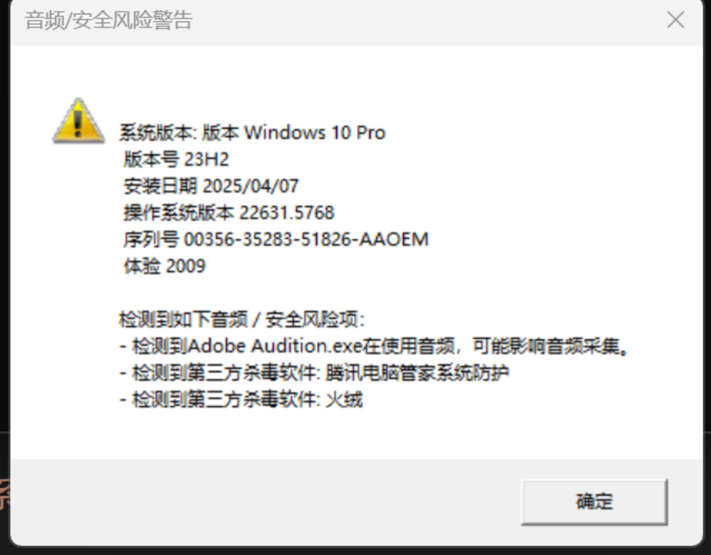

## windows 音频风险监测工具

---

由于 windows 的普及面太广，设备繁杂，各种设置也很多。

团队制作了 windows 下的会议兼容性监测工具。

---

检测项目

1. 麦克风音量
2. 扬声器音量
3. 音量合成器
4. 采样率
5. 第三方杀毒软件权限限制
6. 不兼容设备列表
7. 设备是否有效
8. 蓝牙协议是否完整
9. 麦克风是否被独占不可用
10. 检测是否有采集和播放
11. 检测 Windows 麦克风权限

#### 驱动检测工具

[HWiNFO64](https://pc.qq.com/detail/17/detail_22117.html)

[驱动总裁](https://pc.qq.com/detail/15/detail_24455.html)
