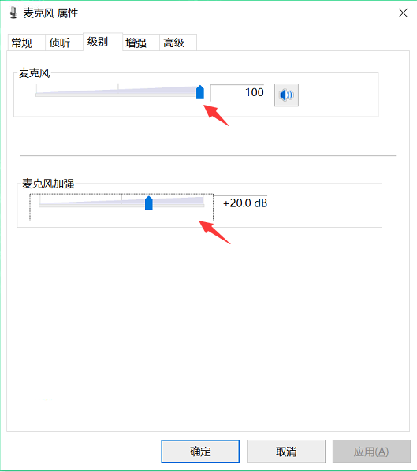

## Windows 系统音频驱动版本

[系统音频设置查看和修复](https://zhuanlan.zhihu.com/p/704273952)

#### 麦克风增强级别

如果出现麦克风无声，突然声音变为纯杂音

找到输入设备，当前使用的麦克风属性，点击右键属性，找到级别里面，麦克风加强改为 0，麦克风能量改为 50（默认 100）

切换到增强，禁用音频增强

[麦克风属性](https://iknow.lenovo.com.cn/detail/155071)

#### 麦克风设置

找到，Windows 设置，系统>声音>输入设备>选中使用中的麦克风

检查音频增强功能，如果需要接收背景音，需要关闭音频增强和空间音效。并在腾讯会议中使用音乐模式。

如果想要纯正人声，则开启音频增强功能。

#### 音频设置或驱动版本查看

找到系统，声音，属性。右上角驱动安装时间。

检查红框相关设置是否一致，，音频增强如果发现收音效果不好，选择关闭。

#### 驱动更新

您可以使用任何驱动检测软件进行驱动更新，或到官网下载最新驱动。

下面以驱动总裁为例

软件下载

https://www.sysceo.com/dc

驱动安装，点击一键安装，或只安装音频相关驱动。

点击返回按钮，或关闭软件

