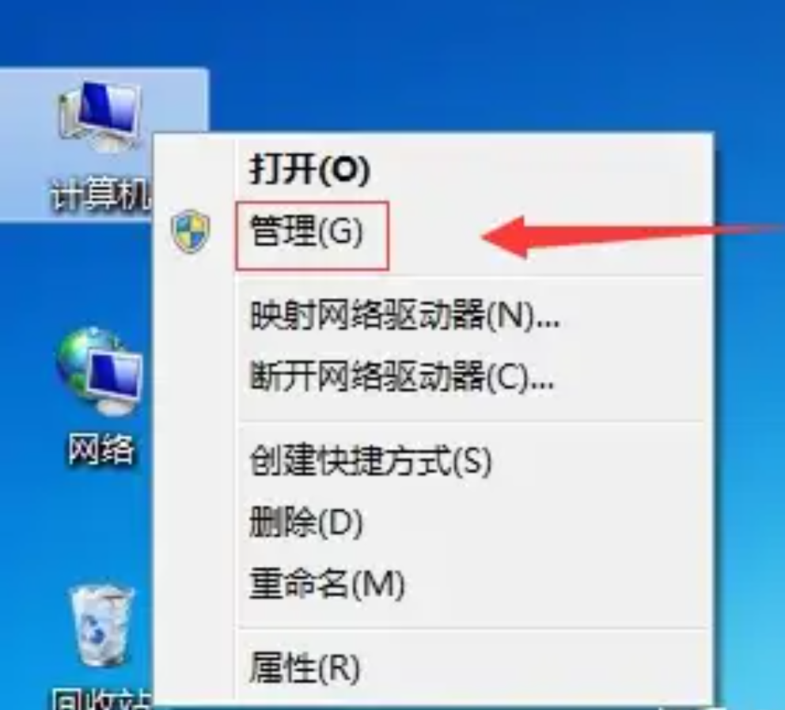
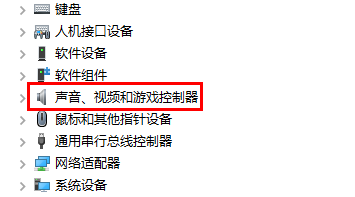
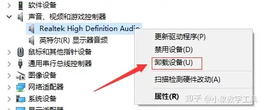
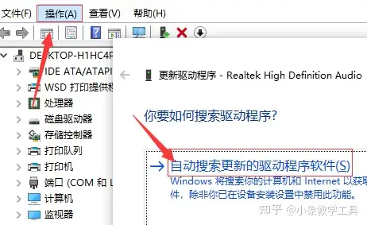

## 打开设备管理器

1. 右键 此电脑 -> 查看更多选项 -> 管理 -> 设备管理器

2. 找到设备管理器

3. 展开后，对所有设备右键卸载，勾选卸载

4. 重启电脑

5. 扫描硬件变化

6. 重启电脑

更多参考 [https://www.zhihu.com/question/474810921/answer/3359694150](https://www.zhihu.com/question/474810921/answer/3359694150)
